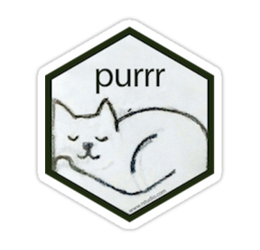

functions with R
========================================================
author: Hezi Buba & Irene Steves
date: 18/12/2018
autosize: true

Presentation materials: https://github.com/ecodatasci-tlv/functions 

Why write functions?
========================================================
Sometimes, we tend to repeat ourselves when coding: Repeating similar analyses, getting data ready for plots, etc.
Functions have multiple advantages over copy and pasting chuncks of code:
- Naming a function improve readability of code ("write codes for humans")
- Changing paramters and conditions in one place.
- Eliminate chance of mistakes due to copy-pasting.

When to write functions?
=======================================================
A good rule of thumb is to not copy and paste code more than twice.


```r
df$a <- (df$a - min(df$a, na.rm = TRUE)) / 
  (max(df$a, na.rm = TRUE) - min(df$a, na.rm = TRUE))
df$b <- (df$b - min(df$b, na.rm = TRUE)) / 
  (max(df$b, na.rm = TRUE) - min(df$a, na.rm = TRUE))
df$c <- (df$c - min(df$c, na.rm = TRUE)) / 
  (max(df$c, na.rm = TRUE) - min(df$c, na.rm = TRUE))
df$d <- (df$d - min(df$d, na.rm = TRUE)) / 
  (max(df$d, na.rm = TRUE) - min(df$d, na.rm = TRUE))
```


Writing functions
========================================================


>"It is faster to make a four-inch mirror then a six-inch mirror than to make a six-inch mirror." 

****

1. Start with a limited but working chuck of code.
2. Rewrite it as a function. (psst.. FUN snippet..)

```r
name <- function(variables) {
  
}
```

3. Test it. OPTIONAL: conditional stopping of functions.
4. Name it. 
5. Use it in your code or within a more complicated function. 

How much code do we want to encapsule in a funcion?
========================================================
Suprisingly, not so much. Focus on your function doing just one thing.

Most of R's functions are less than 12 lines long!


Naming functions
========================================================
Function names should be kept short yet informative. Remember: functions are meant to help codes be reusable and readable.

What are good names for these two functions?


```r
f1 <- function(string, prefix) {
  substr(string, 1, nchar(prefix)) == prefix
}
f2 <- function(x) {
  if (length(x) <= 1) return(NULL)
  x[-length(x)]
}
```


Anonymous functions
========================================================
Sometimes, you won't save the function like seen below, but rather - use it directly in a code:


```r
matrix_of_numbers <- matrix(1:100,10,10)
apply(matrix_of_numbers,2,function(x) x^2)
```

```
      [,1] [,2] [,3] [,4] [,5] [,6] [,7] [,8] [,9] [,10]
 [1,]    1  121  441  961 1681 2601 3721 5041 6561  8281
 [2,]    4  144  484 1024 1764 2704 3844 5184 6724  8464
 [3,]    9  169  529 1089 1849 2809 3969 5329 6889  8649
 [4,]   16  196  576 1156 1936 2916 4096 5476 7056  8836
 [5,]   25  225  625 1225 2025 3025 4225 5625 7225  9025
 [6,]   36  256  676 1296 2116 3136 4356 5776 7396  9216
 [7,]   49  289  729 1369 2209 3249 4489 5929 7569  9409
 [8,]   64  324  784 1444 2304 3364 4624 6084 7744  9604
 [9,]   81  361  841 1521 2401 3481 4761 6241 7921  9801
[10,]  100  400  900 1600 2500 3600 4900 6400 8100 10000
```


Iterations
========================================================
To further streamline your code, use iterations to repeat chuncks of code.
Most basic are `for` and `while` loops. However, there are more ways to iterate code.

Iterations have three main components: an output, a sequence to iterate over, and the body of code.

Vector allocation will save you a lot of time!
========================================================


```r
library(tictoc)
n_times <- 50000
tic()
a <- NULL
for(i in seq_len(n_times)){
    a <- c(a, i^2)
    a
}
toc()
tic()
a <- vector("double", n_times)
for(i in seq_len(n_times)){
    a[i] <- i^2
}
toc()
```

Sequence
========================================================
`for (i in (1:10))` is a sequence. So is `while TRUE`. 
`for (i in seq_along(10))` is a better way of sequencing if you might get a vector of length 0 like so:


```r
y <- vector("double", 0)
seq_along(y)
```

```
integer(0)
```

```r
#> integer(0)
1:length(y)
```

```
[1] 1 0
```

```r
#> [1] 1 0
```

for i in unique(df$column)
========================================================
That's a common phrase when working with data.  So common that there is a tidyverse package that does it for you.

 We will discuss it shortly...

R is a functional language 
========================================================
That means you can wrap loops within a function and just call that function when neccessary.
Remember - limit your copy and paste as much as possible!


```r
library(tidyverse)
data <- tibble(a=rnorm(10),
               b=rnorm(10))
col_means <- function(dataframe){
  output <- vector("double",ncol(dataframe))
  for (i in seq_along(dataframe)){
    output[[i]] <- mean(dataframe[[i]])
  }
  return(output)
}
col_means(data)
```

```
[1]  0.3631993 -0.3598858
```


99 bottles of beer on the wall
========================================================

Create a function that returns the full song for any number of any vessel (bottles,cans, even boxes... ) of any drink (But no Jägermeister please):

>99 bottles of beer on the wall, 99 bottles of beer. Take one down, pass it around - 98 bottles of beer on the wall
